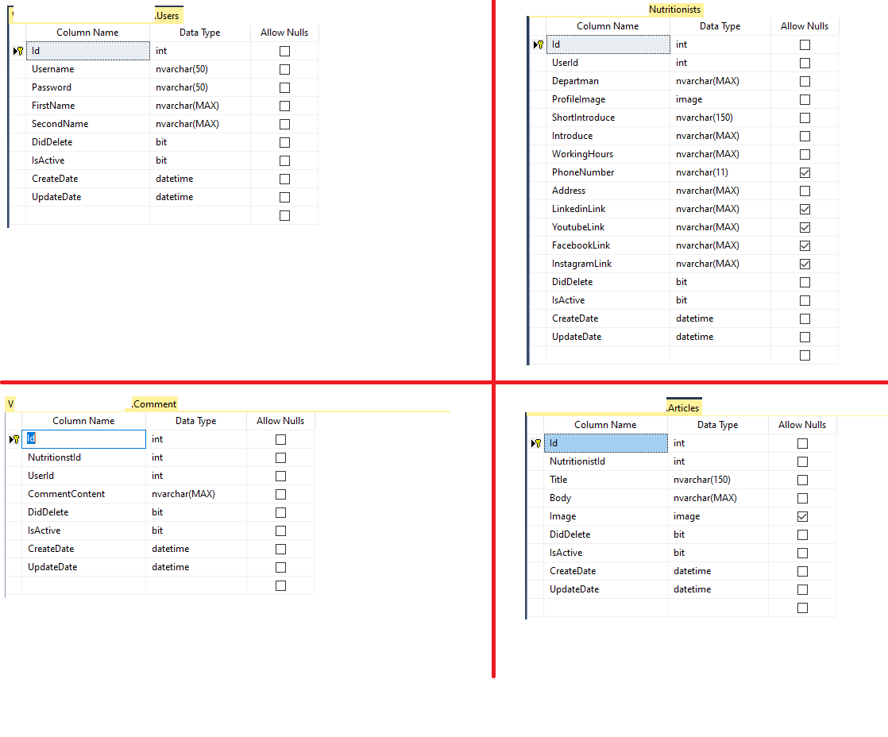
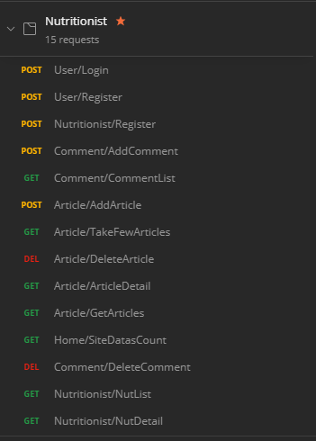
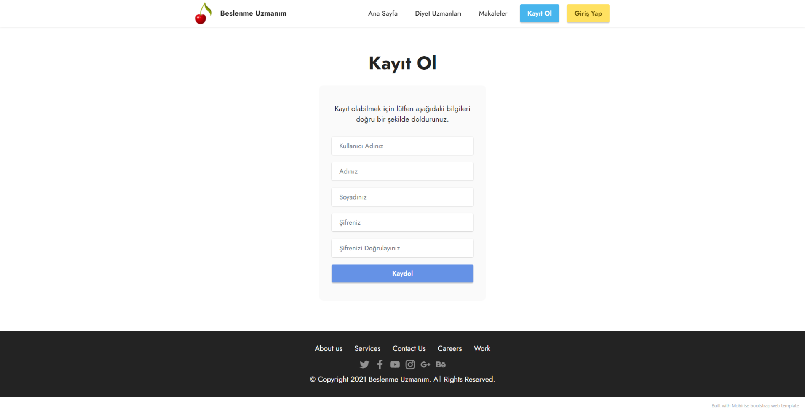
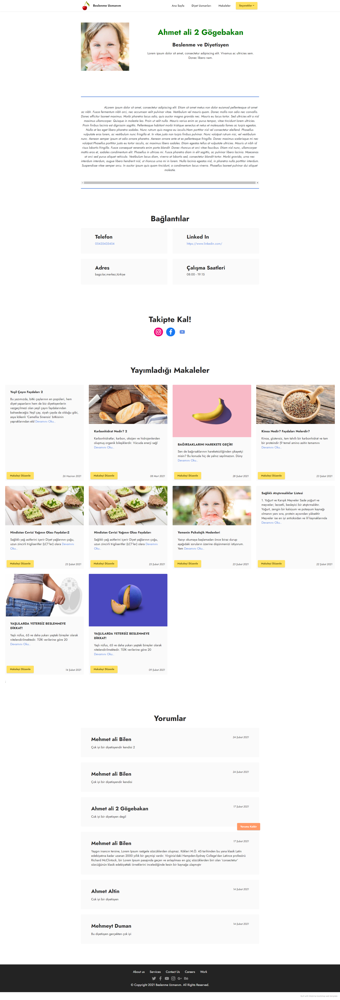
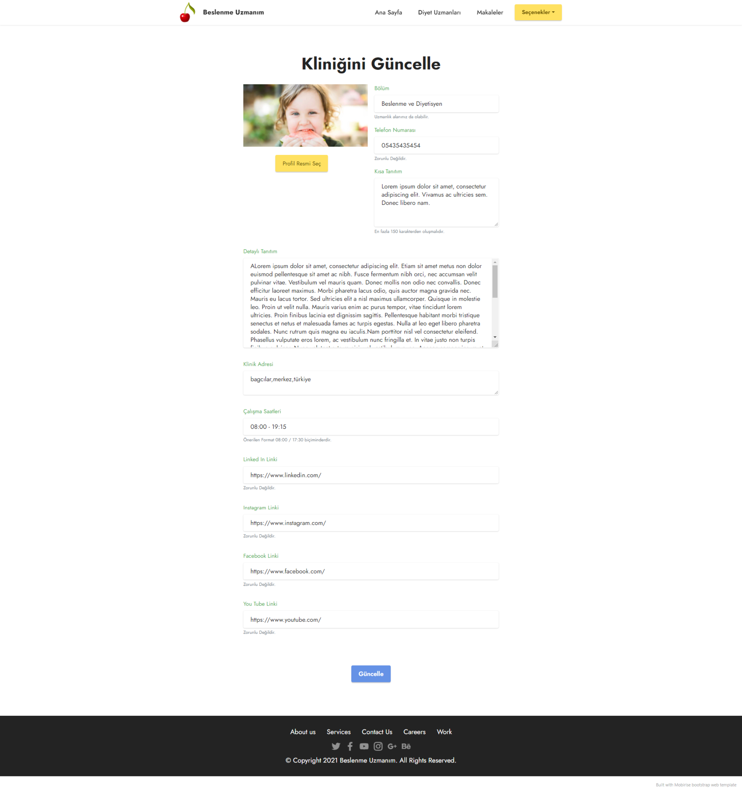
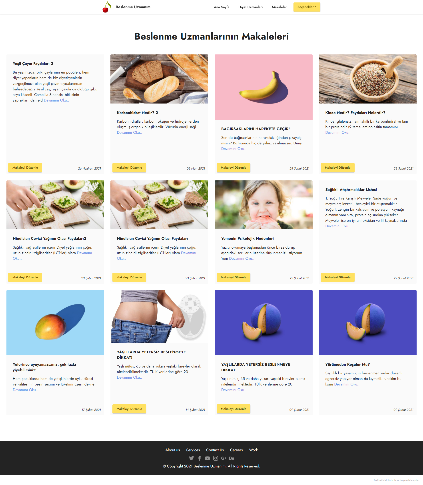
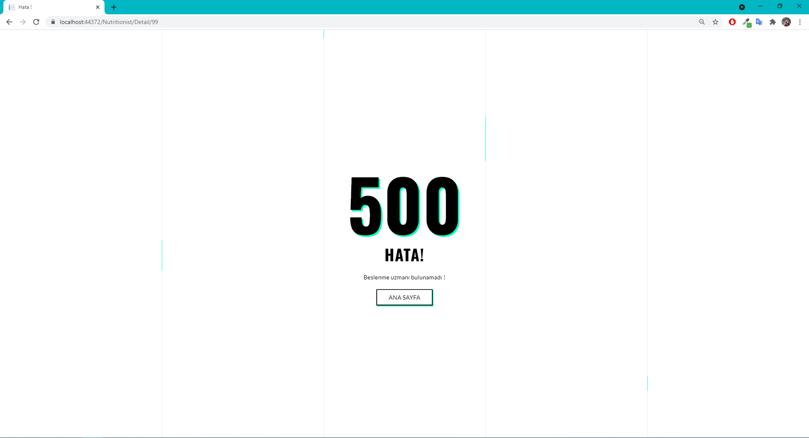

# Beslenme Uzmanım
WEB projesi olan bu platform beslenme uzmanı arayan kişiler ile beslenme uzmanlarının buluşma noktasıdır. Bu proje Kodluyoruz bootcamp final projesi olarak geliştirilmiştir ve [sertifika](https://verified.cv/en/verify/61428597873415)  almaya hak kazanılmıştır. 

# Kullanılan Teknolojiler

- ASP.NET CORE Framework
- Microsoft SQL
- [Mobirise](https://mobirise.com/) (Hızlı, mobil ve üst düzey web siteleri oluşturmak için yazılım)
- Postman

# Kullanılan Paketler

- Authentication.JwtBearer
- AspNetCore.Mvc.Core
- EntityFrameworkCore
- EntityFrameworkCore.SqlServer (DB First olarak kullanılmıştır)
- EntityFramworkCore.Tools
- AutoMapper
- AspNetCore.Session

# Proje İçeriği

- Kullanıcı hesap oluşturma, giriş yapma, bilgilerini güncelleme ve hesabı kaldırma.
- Beslenme uzmanı hesap oluşturma, bilgilerini güncelleme ve hesabı kaldırma.
- İlk giriş ekranı(Ana sayfa).
- Beslenme uzmanlarının gösterilmesi.
- Yayımlanan makalelerin gösterilmesi.
- Profil bilgilerinin(Kişisel bilgiler, Bağlantılar, Makaleler, Yorumlar) gösterilmesi.
- Makale oluşturma, düzenleme ve kaldırma.

Not : Şifreler veri tabanına MD5Hash ile hash edilip kaydedilmiştir.

# [Proje öngösterim videosu için tıklayınız](https://vimeo.com/567818581)

# Projeye Ait Görüntüler

- Veri tabanı için Microsoft SQL Server Management`den görüntüler. 

- Sorgular için Postman de oluşturulan koleksiyonun görüntüsü. 

- Giriş yapma sayfası. 

- Kayıt olma sayfası. 

- Ana sayfa. 

- Profil bilgilerini görüntüleme sayfası. 

- Beslenme uzmanı bilgilerini güncelleme sayfası. 

- Beslenme uzmanı makalelerinin listelendiği sayfa. 

- Hata oluştuğunda gösterilecek sayfa. 

